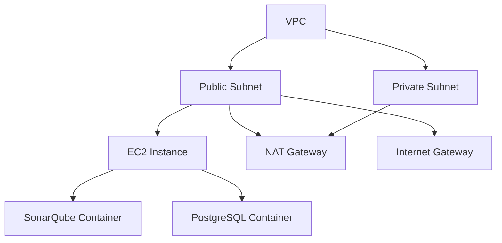

# Terraform AWS SonarQube Deployment

[](https://www.terraform.io/)
[](https://aws.amazon.com/)
[](https://www.sonarqube.org/)
[](https://www.docker.com/)
[](https://www.postgresql.org/)

This Terraform project deploys a production-ready SonarQube instance on AWS using a modular architecture. The infrastructure includes:

- **Networking**: VPC with public and private subnets, Internet Gateway, NAT Gateway, and route tables
- **Security**: Fine-grained security groups, IAM roles with least privilege (including SSM access), and custom SSH port
- **Compute**: EC2 instance with Docker and Docker Compose
- **Application**: SonarQube with PostgreSQL database in Docker containers
- **Management**: AWS Systems Manager (SSM) for secure instance access

## Architecture



## Prerequisites

- AWS CLI configured with appropriate credentials
- Terraform v1.0+ installed
- SSH key pair for EC2 instance access
- Required AWS IAM permissions

## Project Structure

```
terraform-aws-sonarqube/
├── modules/
│   ├── ec2/                # EC2 instance module
│   │   ├── main.tf         # EC2 resource definitions
│   │   ├── variables.tf    # Module variables
│   │   ├── outputs.tf      # Module outputs
│   │   └── user_data.sh    # User data script for EC2 configuration
│   │
│   ├── security-group/     # Security group module
│   │   ├── main.tf         # Security group rules
│   │   ├── variables.tf    # Module variables
│   │   └── outputs.tf      # Module outputs
│   │
│   └── vpc/                # VPC module
│       ├── main.tf         # VPC resources
│       ├── variables.tf    # Module variables
│       └── outputs.tf      # Module outputs
│
├── main.tf                 # Root module configuration
├── variables.tf           # Root variables
├── outputs.tf             # Root outputs
├── providers.tf           # Provider configuration
├── data.tf               # Data sources
├── locals.tf             # Local variables
├── setup.sh              # Setup script for local development
└── README.md             # This file
```

## Handling Sensitive Values

This project follows security best practices for handling sensitive information. Here's how sensitive values are managed:

### 1. Environment Variables
Sensitive values should be passed via environment variables or a `.tfvars` file that is not committed to version control:

```bash
export TF_VAR_sensitive_value="your-secret-here"
```

### 2. AWS Secrets Manager
For production environments, use AWS Secrets Manager to store sensitive information:

```hcl
data "aws_secretsmanager_secret" "example" {
  name = "example-secret-name"
}

data "aws_secretsmanager_secret_version" "example" {
  secret_id = data.aws_secretsmanager_secret.example.id
}

# Access the secret value
locals {
  secret_value = jsondecode(data.aws_secretsmanager_secret_version.example.secret_string)["key"]
}
```

### 3. Sensitive Outputs
All sensitive outputs are marked as such in Terraform to prevent accidental exposure:

```hcl
output "sensitive_output" {
  value     = sensitive_resource.example.sensitive_value
  sensitive = true
}
```

### 4. .gitignore
Ensure your `.gitignore` file includes:
```
# Local .terraform directories
**/.terraform/*

# .tfstate files
*.tfstate
*.tfstate.*

# Crash log files
crash.log
crash.*.log

# Exclude all .tfvars files, which are likely to contain sensitive data
*.tfvars
*.tfvars.json

# Ignore override files as they are usually used for local overrides
override.tf
override.tf.json
*_override.tf
*_override.tf.json

# Ignore CLI configuration files
.terraformrc
terraform.rc
```

### 5. Example `terraform.tfvars.example`
Include an example variables file (without real values) to document required variables:

```hcl
# terraform.tfvars.example
environment = "dev"
key_name    = "your-key-pair-name"
# Sensitive values should be provided via environment variables or secrets manager
# sensitive_value = ""
```

## Getting Started

### Prerequisites

- AWS CLI configured with appropriate credentials
- Terraform v1.0+ installed
- SSH key pair for EC2 instance access (if not using SSM)
- Required AWS IAM permissions

### Deployment Steps

1. Clone the repository:
   ```bash
   git clone <repository-url>
   cd terraform-aws-sonarqube
   ```

2. Initialize Terraform:
   ```bash
   terraform init
   ```

3. Create a `terraform.tfvars` file using the example below. For sensitive values, use environment variables or AWS Secrets Manager as described in the "Handling Sensitive Values" section.

   First, copy the example file:
   ```bash
   cp terraform.tfvars.example terraform.tfvars
   ```

   Then edit `terraform.tfvars` with your values:
   ```hcl
   # Basic configuration
   environment      = "prod"
   instance_type    = "t3.medium"
   
   # Network configuration
   vpc_cidr         = "10.0.0.0/16"
   public_subnet_cidr  = "10.0.1.0/24"
   private_subnet_cidr = "10.0.2.0/24"
   
   # Security settings
   ssh_port         = 69  # Custom SSH port
   
   # For production, use environment variables or AWS Secrets Manager
   # key_name = "${var.key_name}"  # Set via TF_VAR_key_name environment variable
   
   # Example of using AWS Secrets Manager for sensitive values
   # db_credentials = data.aws_secretsmanager_secret_version.db_creds.secret_string
   ```
   
   **Important**: Add `terraform.tfvars` to your `.gitignore` file to prevent committing sensitive data.

4. Review the execution plan:
   ```bash
   terraform plan
   ```

5. Apply the configuration:
   ```bash
   terraform apply
   ```

6. Access SonarQube:
   - URL: Use the `sonarqube_url` output value (e.g., http://<public-ip>:9000)
   - Default credentials: admin/admin
   - SSH Access: Use the custom port (default: 69) or use AWS Systems Manager Session Manager

### Accessing the Instance

#### Using AWS Systems Manager (Recommended)
1. Install the Session Manager plugin for AWS CLI
2. Use the instance ID from the outputs to start a session:
   ```bash
   aws ssm start-session --target <instance-id>
   ```

#### Using SSH
```bash
ssh -i your-key.pem -p 69 ubuntu@<public-ip>
```

## Key Features

### VPC Module
- Creates a VPC with public and private subnets in the specified CIDR ranges
- Configures route tables with internet and NAT gateways
- Enables DNS hostnames and DNS resolution
- Manages route table associations

### Security Group Module
- Implements fine-grained security group rules
- Restricts SSH access to custom port (default: 69)
- Opens only necessary ports (HTTP, SonarQube UI, custom SSH)
- Allows ICMP (ping) for network troubleshooting
- Implements least-privilege security group rules

### EC2 Module
- Deploys an EC2 instance with the latest Ubuntu AMI
- Configures Docker and Docker Compose via user data
- Sets up SonarQube with PostgreSQL in containers
- Configures IAM role with SSM access for secure instance management
- Manages EBS root volume with configurable size and type

## Variables

### Global Variables
| Name | Description | Type | Default |
|------|-------------|------|---------|
| `environment` | Environment name (e.g., dev, staging, prod) | string | `"dev"` |
| `region` | AWS region to deploy resources | string | `"us-east-1"` |

### VPC Configuration
| Name | Description | Type | Default |
|------|-------------|------|---------|
| `vpc_cidr` | CIDR block for the VPC | string | `"10.0.0.0/16"` |
| `public_subnet_cidr` | CIDR block for the public subnet | string | `"10.0.1.0/24"` |
| `private_subnet_cidr` | CIDR block for the private subnet | string | `"10.0.2.0/24"` |

### EC2 Configuration
| Name | Description | Type | Default |
|------|-------------|------|---------|
| `instance_type` | EC2 instance type | string | `"t3.medium"` |
| `key_name` | Name of the SSH key pair | string | `"terraform-test-kp"` |
| `root_volume_size` | Root volume size in GB | number | `30` |
| `root_volume_type` | Root volume type (gp2, gp3, io1) | string | `"gp3"` |

### Security Group Configuration
| Name | Description | Type | Default |
|------|-------------|------|---------|
| `ssh_port` | Port for SSH access | number | `69` |
| `default_ssh_port` | Default SSH port (22) | number | `22` |
| `http_port` | Port for HTTP access | number | `80` |
| `sonar_port` | Port for SonarQube web interface | number | `9000` |
| `icmp_port` | Port for ICMP (ping) | number | `-1` |

## Outputs

| Name | Description |
|------|-------------|
| `sonarqube_url` | URL to access SonarQube web interface |
| `instance_public_ip` | Public IP of the EC2 instance |
| `ssh_connection_command` | SSH command to connect to the instance |
| `vpc_id` | The ID of the VPC |
| `public_subnet_id` | The ID of the public subnet |
| `security_group_id` | The ID of the security group |

## Security Considerations

- Uses a custom SSH port (default: 2200)
- Implements security group rules with least privilege
- Uses IAM roles with minimum required permissions
- All resources are tagged for cost allocation and management
- Instance metadata service (IMDS) is secured

## Maintenance

### Upgrading
1. Update the module versions in `main.tf`
2. Run `terraform init -upgrade`
3. Review and apply changes

### Monitoring
- CloudWatch Logs for Docker containers
- EC2 instance metrics
- VPC flow logs (recommended for production)

## Clean Up

To destroy all resources:

```bash
terraform destroy
```

## License

This project is licensed under the MIT License - see the [LICENSE](LICENSE) file for details.
