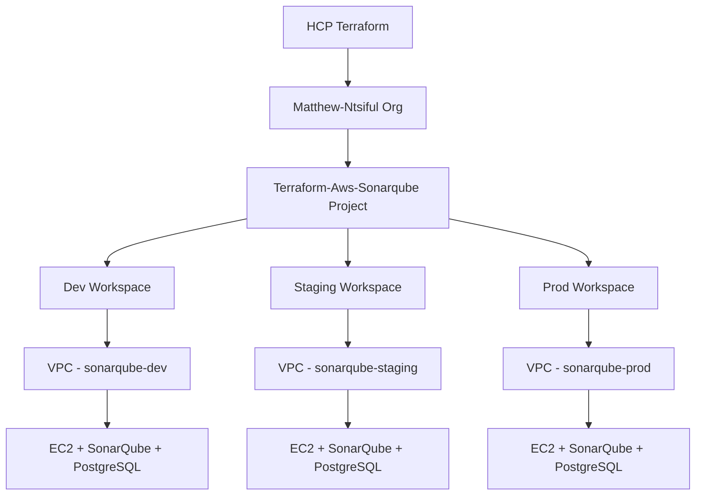

# Terraform AWS SonarQube Deployment


A production-ready Terraform project that deploys SonarQube on AWS using HCP Terraform for remote state management and multi-environment support.

## 🏗️ Architecture



## ✨ Features

- **🏢 Multi-Environment**: HCP Terraform workspace-based deployments (dev/staging/prod)
- **🌐 Remote State**: HCP Terraform backend with workspace isolation
- **📦 Modular Design**: Reusable VPC, Security Group, and EC2 modules
- **🔒 Enhanced Security**: Custom SSH port, security groups with least privilege
- **🐳 Containerized**: SonarQube and PostgreSQL in Docker containers
- **📊 Monitoring**: CloudWatch integration and comprehensive debug outputs
- **🏷️ Smart Tagging**: Automatic workspace-based tagging for resource identification
- **🔧 Configurable**: All ports and settings via variables

## 📁 Project Structure

```
terraform-aws-sonarqube/
├── modules/
│   ├── ec2/                # EC2 instance with Docker setup
│   ├── security-group/     # Security group with configurable ports
│   └── vpc/                # VPC with public/private subnets
├── main.tf                 # Root module configuration
├── variable.tf             # Input variables
├── outputs.tf              # Output values with sensitive handling
├── locals.tf               # Local values and workspace-based naming
├── providers.tf            # HCP Terraform backend configuration
├── terraform.auto.tfvars   # Auto-loaded default values
└── README.md              # This file
```

## 🚀 Quick Start

### Prerequisites

- **Terraform CLI** v1.0+ installed
- **HCP Terraform Account** with organization access
- **AWS CLI** configured with appropriate credentials
- **SSH key pair** for EC2 instance access

### HCP Terraform Setup

The project uses HCP Terraform with the following configuration:
- **Organization**: `Matthew-Ntsiful`
- **Project**: `Terraform-Aws-Sonarqube`
- **Workspaces**: Tagged with `["sonarqube"]`

### Deployment Steps

1. **Clone and Initialize**
   ```bash
   git clone <repository-url>
   cd terraform-aws-sonarqube
   terraform init
   ```
   *When prompted for workspace name, enter: `dev`*

2. **Create Additional Workspaces**
   ```bash
   terraform workspace new staging
   terraform workspace new prod
   ```

3. **Configure AWS Credentials in HCP**
   - Navigate to HCP Terraform → Your Organization → Workspace
   - Add environment variables:
     - `AWS_ACCESS_KEY_ID` (sensitive)
     - `AWS_SECRET_ACCESS_KEY` (sensitive)
     - `AWS_DEFAULT_REGION` = `us-east-1`

4. **Deploy to Environment**
   ```bash
   # Switch to desired environment
   terraform workspace select dev
   
   # Plan and apply
   terraform plan
   terraform apply
   ```

5. **Access SonarQube**
   - URL: Use the `sonarqube_url` output
   - Default credentials: admin/admin
   - SSH: Use the `ssh_connection_command` output

## ⚙️ Configuration

### Auto-Loaded Variables

The `terraform.auto.tfvars` file provides default values:

```hcl
# Global Configuration
region = "us-east-1"

# VPC Configuration
vpc_cidr            = "10.0.0.0/16"
public_subnet_cidr  = "10.0.1.0/24"
private_subnet_cidr = "10.0.2.0/24"

# EC2 Configuration
instance_type     = "t3.medium"
key_name         = "terraform-test-kp"
root_volume_size = 30
root_volume_type = "gp3"

# Security Configuration
ssh_port = 69  # Custom SSH port for enhanced security
```

### Environment-Specific Overrides

You can override variables per workspace in HCP Terraform:
- **Dev**: Smaller instance types, relaxed security
- **Staging**: Production-like setup for testing
- **Prod**: High-availability, enhanced security

## 🏷️ Resource Tagging

All resources are automatically tagged with:

```hcl
{
  Environment = terraform.workspace  # dev/staging/prod
  Project     = "SonarQube"
  ManagedBy   = "Terraform"
  Owner       = "Matthew Ntsiful"
  Workspace   = terraform.workspace
  CostCenter  = "Engineering"
  Application = "SonarQube"
}
```

## 📊 Outputs

The deployment provides comprehensive outputs:

- **Instance Details**: IDs, IPs, DNS names
- **Access Information**: SSH commands, SonarQube URLs
- **Infrastructure IDs**: VPC, subnets, security groups
- **Debug Commands**: Troubleshooting and monitoring commands
- **Security Notes**: Important security considerations

## 🔐 Security Features

- **Custom SSH Port**: Port 69 instead of default 22
- **Security Groups**: Least privilege access rules
- **IAM Roles**: Minimal required permissions for SSM access
- **Encrypted Storage**: EBS volumes with encryption
- **Network Isolation**: Private subnets for sensitive resources
- **Sensitive Outputs**: Properly marked to prevent exposure

## 🌍 Multi-Environment Management

### Workspace Operations

```bash
# List all workspaces
terraform workspace list

# Switch environments
terraform workspace select dev
terraform workspace select staging
terraform workspace select prod

# Deploy to current workspace
terraform plan
terraform apply

# View current workspace
terraform workspace show
```

### Environment Isolation

Each workspace creates:
- **Separate Infrastructure**: Complete isolation between environments
- **Unique Resource Names**: `sonarqube-{workspace}` naming convention
- **Independent State**: Managed in HCP Terraform
- **Environment-Specific Tags**: Automatic workspace tagging

## 🛠️ Maintenance

### Upgrading Infrastructure
```bash
terraform workspace select <environment>
terraform plan
terraform apply
```

### Monitoring and Debugging
- **CloudWatch Logs**: Container and system monitoring
- **Debug Commands**: Available in outputs for troubleshooting
- **HCP Terraform UI**: Centralized state and run management

### Cleanup
```bash
# Destroy specific environment
terraform workspace select dev
terraform destroy

# Or destroy all environments
for env in dev staging prod; do
  terraform workspace select $env
  terraform destroy -auto-approve
done
```

## 📋 Requirements

- **Terraform**: >= 1.0.0
- **AWS Provider**: Latest version (auto-detected)
- **HCP Terraform**: Organization access required
- **AWS Permissions**: EC2, VPC, IAM, CloudWatch access

## 🤝 Contributing

1. Fork the repository
2. Create a feature branch
3. Test in dev environment first
4. Submit a pull request with detailed description

## 📄 License

This project is licensed under the MIT License - see the [LICENSE](LICENSE) file for details.

## 🆘 Support

For issues and questions:
- Check HCP Terraform run logs
- Review debug outputs for troubleshooting
- Examine CloudWatch logs for application issues
- Open an issue in the repository

---

**⚠️ Important Security Notes:**
- Always change default SonarQube admin password
- Review security group rules before production deployment
- Use HTTPS for production SonarQube access
- Regularly update container images and system packages
- Monitor AWS costs and resource usage across environments
<!-- Pipeline Test: Sat Aug  9 14:55:13 GMT 2025 - Testing GitHub Actions + HCP Terraform + Slack integration -->
