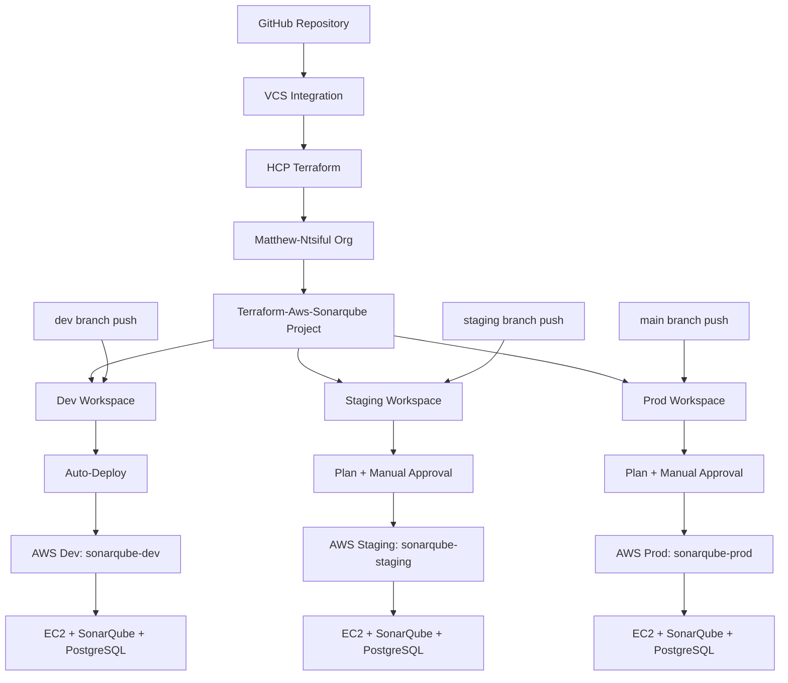

# Terraform AWS SonarQube Deployment


A production-ready Terraform project that deploys SonarQube on AWS using HCP Terraform for remote state management and multi-environment support.

## 🏗️ Architecture



## ✨ Features

- **🔄 VCS-Driven CI/CD**: Automated deployments triggered by git pushes to specific branches
- **🏢 Multi-Environment**: HCP Terraform workspace-based deployments (dev/staging/prod)
- **🌐 Remote State**: HCP Terraform backend with workspace isolation
- **📦 Modular Design**: Reusable VPC, Security Group, and EC2 modules
- **🔒 Enhanced Security**: Custom SSH port, security groups with least privilege
- **🐳 Containerized**: SonarQube and PostgreSQL in Docker containers
- **📊 Monitoring**: CloudWatch integration and comprehensive debug outputs
- **🏷️ Smart Tagging**: Automatic workspace-based tagging for resource identification
- **🔧 Configurable**: All ports and settings via variables

## 📁 Project Structure

```
terraform-aws-sonarqube/
├── modules/
│   ├── ec2/                # EC2 instance with Docker setup
│   ├── security-group/     # Security group with configurable ports
│   └── vpc/                # VPC with public/private subnets
├── main.tf                 # Root module configuration
├── variable.tf             # Input variables
├── outputs.tf              # Output values with sensitive handling
├── locals.tf               # Local values and workspace-based naming
├── providers.tf            # HCP Terraform backend configuration
├── terraform.auto.tfvars   # Auto-loaded default values
└── README.md              # This file
```

## 🚀 Quick Start

### Prerequisites

- **Terraform CLI** v1.0+ installed
- **HCP Terraform Account** with organization access
- **AWS CLI** configured with appropriate credentials
- **SSH key pair** for EC2 instance access

### HCP Terraform Setup

The project uses HCP Terraform with the following configuration:
- **Organization**: `Matthew-Ntsiful`
- **Project**: `Terraform-Aws-Sonarqube`
- **Workspaces**: Tagged with `["sonarqube"]`

### Deployment Options

This project supports **both CLI and VCS-driven workflows**, demonstrating enterprise-grade DevOps practices:

#### **Option 1: CLI-Based Deployment**

1. **Clone and Initialize**
   ```bash
   git clone <repository-url>
   cd terraform-aws-sonarqube
   terraform init
   ```
   *When prompted for workspace name, enter: `dev`*

2. **Create Additional Workspaces**
   ```bash
   terraform workspace new staging
   terraform workspace new prod
   ```

3. **Deploy to Environment**
   ```bash
   # Switch to desired environment
   terraform workspace select dev
   
   # Plan and apply
   terraform plan
   terraform apply
   ```

#### **Option 2: VCS-Driven CI/CD (Production Recommended)**

The project uses **HCP Terraform VCS integration** for automated CI/CD:

**Branch Strategy:**
- **`dev` branch** → Auto-deploys to dev environment
- **`staging` branch** → Plans staging, requires manual approval
- **`main` branch** → Plans production, requires manual approval

**Development Workflow:**

1. **Development Changes**
   ```bash
   git checkout dev
   # Make your changes
   git add . && git commit -m "Update infrastructure"
   git push origin dev     # → Triggers auto-deployment to dev
   ```

2. **Promote to Staging**
   ```bash
   git checkout staging
   git merge dev
   git push origin staging # → Triggers plan, awaits approval in HCP UI
   ```

3. **Promote to Production**
   ```bash
   git checkout main
   git merge staging
   git push origin main    # → Triggers plan, awaits approval in HCP UI
   ```

#### **Configuration**

**Configure AWS Credentials in HCP**
- Navigate to HCP Terraform → Your Organization → Each Workspace
- Add environment variables:
  - `AWS_ACCESS_KEY_ID` (sensitive)
  - `AWS_SECRET_ACCESS_KEY` (sensitive)
  - `AWS_DEFAULT_REGION` = `us-east-1`

**Access SonarQube**
- URL: Check HCP Terraform workspace outputs for `sonarqube_url`
- Default credentials: admin/admin
- SSH: Use the `ssh_connection_command` output

## ⚙️ Configuration

### Auto-Loaded Variables

The `terraform.auto.tfvars` file provides default values:

```hcl
# Global Configuration
region = "us-east-1"

# VPC Configuration
vpc_cidr            = "10.0.0.0/16"
public_subnet_cidr  = "10.0.1.0/24"
private_subnet_cidr = "10.0.2.0/24"

# EC2 Configuration
instance_type     = "t3.medium"
key_name         = "terraform-test-kp"
root_volume_size = 30
root_volume_type = "gp3"

# Security Configuration
ssh_port = 69  # Custom SSH port for enhanced security
```

### Environment-Specific Overrides

You can override variables per workspace in HCP Terraform:
- **Dev**: Smaller instance types, relaxed security
- **Staging**: Production-like setup for testing
- **Prod**: High-availability, enhanced security

## 🏷️ Resource Tagging

All resources are automatically tagged with:

```hcl
{
  Environment = terraform.workspace  # dev/staging/prod
  Project     = "SonarQube"
  ManagedBy   = "Terraform"
  Owner       = "Matthew Ntsiful"
  Workspace   = terraform.workspace
  CostCenter  = "Engineering"
  Application = "SonarQube"
}
```

## 📊 Outputs

The deployment provides comprehensive outputs:

- **Instance Details**: IDs, IPs, DNS names
- **Access Information**: SSH commands, SonarQube URLs
- **Infrastructure IDs**: VPC, subnets, security groups
- **Debug Commands**: Troubleshooting and monitoring commands
- **Security Notes**: Important security considerations

## 🔐 Security Features

- **Custom SSH Port**: Port 69 instead of default 22
- **Security Groups**: Least privilege access rules
- **IAM Roles**: Minimal required permissions for SSM access
- **Encrypted Storage**: EBS volumes with encryption
- **Network Isolation**: Private subnets for sensitive resources
- **Sensitive Outputs**: Properly marked to prevent exposure

## 🌍 Multi-Environment Management

### CLI Operations with VCS-Connected Workspaces

**Read-Only Operations (Always Available):**
```bash
# Workspace management
terraform workspace list
terraform workspace show
terraform workspace select <environment>

# State inspection
terraform state list
terraform state show <resource>
terraform show

# Output viewing
terraform output
terraform output <output_name>

# Configuration validation
terraform validate
terraform fmt -check
```

**Write Operations (VCS-Only for Connected Workspaces):**
```bash
# These require VCS workflow when workspace is VCS-connected
terraform plan    # Use HCP UI or VCS triggers
terraform apply   # Use HCP UI or VCS triggers  
terraform destroy # Use HCP UI destruction workflow
```

**Note**: VCS-connected workspaces enforce "single source of truth" - infrastructure changes must go through VCS workflow, but CLI inspection and debugging remain fully available.

### VCS-Driven Workflow

```bash
# Development workflow
git checkout dev
git add . && git commit -m "changes"
git push origin dev        # → Auto-deploys to dev

# Staging promotion
git checkout staging
git merge dev
git push origin staging    # → Plans staging, awaits approval

# Production promotion
git checkout main
git merge staging
git push origin main       # → Plans prod, awaits approval
```

### Environment Isolation

Each workspace creates:
- **Separate Infrastructure**: Complete isolation between environments
- **Unique Resource Names**: `sonarqube-{workspace}` naming convention
- **Independent State**: Managed in HCP Terraform
- **Environment-Specific Tags**: Automatic workspace tagging
- **Branch-Based Triggers**: Each environment tied to specific git branches

### Auto-Apply Settings
- **Dev**: Auto-apply enabled for VCS triggers (fast feedback)
- **Staging**: Manual approval required (testing workflow)
- **Prod**: Manual approval required (maximum safety)

## 🛠️ Maintenance

### Upgrading Infrastructure

**Via CLI:**
```bash
terraform workspace select <environment>
terraform plan
terraform apply
```

**Via VCS (Production Recommended):**
```bash
# Make changes and push to appropriate branch
git checkout dev
# Edit terraform files
git add . && git commit -m "Upgrade instance type"
git push origin dev     # → Triggers deployment
```

**Via HCP UI:**
- Navigate to workspace in HCP Terraform
- Queue plan manually if needed
- Review and apply changes

### Monitoring and Debugging
- **HCP Terraform UI**: Centralized run history and state management
- **CloudWatch Logs**: Container and system monitoring
- **Debug Commands**: Available in workspace outputs
- **Run Logs**: Detailed logs for each deployment in HCP

### Cleanup
**Via HCP UI (Recommended):**
- Go to workspace → Settings → Destruction and Deletion
- Queue destroy plan
- Review and confirm destruction

**Via CLI (Non-VCS Workspaces Only):**
```bash
# Only works if workspace is not VCS-connected
terraform workspace select dev
terraform destroy
```

**Note**: For VCS-connected workspaces, use HCP UI destruction workflow to maintain VCS as single source of truth.

## 📋 Requirements

- **Terraform**: >= 1.0.0
- **AWS Provider**: Latest version (auto-detected)
- **HCP Terraform**: Organization access required
- **AWS Permissions**: EC2, VPC, IAM, CloudWatch access

## 🤝 Contributing

1. Fork the repository
2. Create a feature branch
3. Test in dev environment first
4. Submit a pull request with detailed description

## 📄 License

This project is licensed under the MIT License - see the [LICENSE](LICENSE) file for details.

## 🆘 Support

For issues and questions:
- Check HCP Terraform run logs
- Review debug outputs for troubleshooting
- Examine CloudWatch logs for application issues
- Open an issue in the repository

---

**⚠️ Important Security Notes:**
- Always change default SonarQube admin password
- Review security group rules before production deployment
- Use HTTPS for production SonarQube access
- Regularly update container images and system packages
- Monitor AWS costs and resource usage across environments
<!-- Pipeline Test: Sat Aug  9 14:55:13 GMT 2025 - Testing GitHub Actions + HCP Terraform + Slack integration -->
