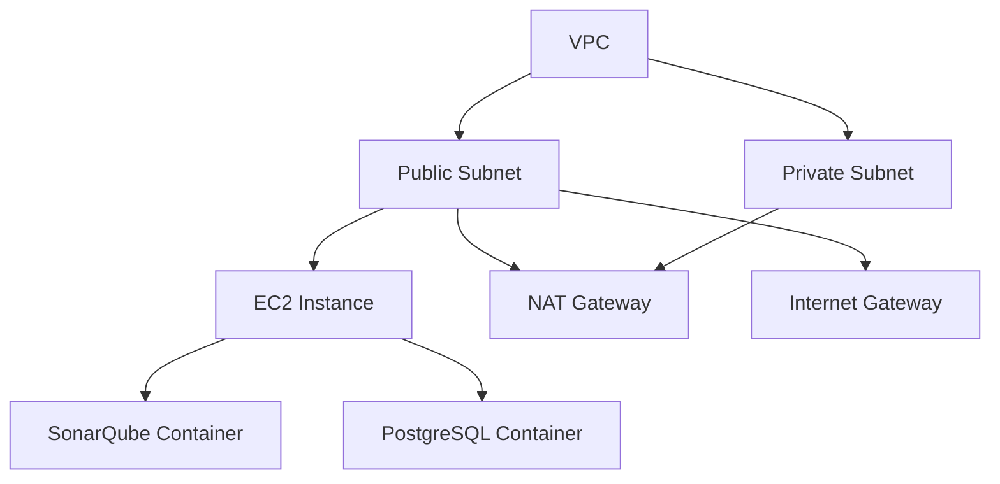

# Terraform AWS SonarQube Deployment

This Terraform project deploys a production-ready SonarQube instance on AWS using a modular architecture. The infrastructure includes:

- **Networking**: VPC with public and private subnets, Internet Gateway, NAT Gateway, and route tables
- **Security**: Fine-grained security groups, IAM roles with least privilege, and custom SSH port
- **Compute**: EC2 instance with Docker and Docker Compose
- **Application**: SonarQube with PostgreSQL database in Docker containers

## Architecture



## Prerequisites

- AWS CLI configured with appropriate credentials
- Terraform v1.0+ installed
- SSH key pair for EC2 instance access
- Required AWS IAM permissions

## Project Structure

```
terraform-aws-sonarqube/
├── modules/
│   ├── ec2/                # EC2 instance module
│   │   ├── main.tf         # EC2 resource definitions
│   │   ├── variables.tf    # Module variables
│   │   └── outputs.tf      # Module outputs
│   │
│   ├── security-group/     # Security group module
│   │   ├── main.tf         # Security group rules
│   │   ├── variables.tf    # Module variables
│   │   └── outputs.tf      # Module outputs
│   │
│   └── vpc/                # VPC module
│       ├── main.tf         # VPC resources
│       ├── variables.tf    # Module variables
│       └── outputs.tf      # Module outputs
│
├── main.tf                 # Root module configuration
├── variables.tf            # Root variables
├── outputs.tf             # Root outputs
├── providers.tf           # Provider configuration
└── README.md              # This file
```

## Getting Started

1. Clone the repository:
   ```bash
   git clone <repository-url>
   cd terraform-aws-sonarqube
   ```

2. Initialize Terraform:
   ```bash
   terraform init
   ```

3. Review variables in `variables.tf` and create a `terraform.tfvars` file if needed:
   ```hcl
   environment      = "prod"
   instance_type    = "t3.medium"
   key_name         = "your-key-pair"
   ssh_port         = 2200
   vpc_cidr         = "10.0.0.0/16"
   public_subnet_cidr  = "10.0.1.0/24"
   private_subnet_cidr = "10.0.2.0/24"
   ```

4. Review the execution plan:
   ```bash
   terraform plan
   ```

5. Apply the configuration:
   ```bash
   terraform apply
   ```

6. Access SonarQube:
   - URL: Use the `sonarqube_url` output value
   - Default credentials: admin/admin
   - SSH Access: Use the `ssh_connection_command` output

## Key Features

### VPC Module
- Creates a VPC with public and private subnets
- Configures route tables and internet/NAT gateways
- Enables DNS hostnames and support

### Security Group Module
- Restricts SSH access to specified IP ranges
- Opens only necessary ports (HTTP, SonarQube UI, SSH)
- Implements least-privilege security group rules

### EC2 Module
- Deploys an EC2 instance with the latest Ubuntu AMI
- Configures Docker and Docker Compose
- Sets up SonarQube with PostgreSQL in containers
- Applies custom security hardening

## Variables

| Name | Description | Type | Default |
|------|-------------|------|---------|
| `environment` | Environment name (dev/staging/prod) | string | `"dev"` |
| `region` | AWS region | string | `"us-east-1"` |
| `instance_type` | EC2 instance type | string | `"t3.medium"` |
| `key_name` | Name of the SSH key pair | string | `""` |
| `ssh_port` | Custom SSH port | number | `2200` |
| `vpc_cidr` | VPC CIDR block | string | `"10.0.0.0/16"` |
| `public_subnet_cidr` | Public subnet CIDR | string | `"10.0.1.0/24"` |
| `private_subnet_cidr` | Private subnet CIDR | string | `"10.0.2.0/24"` |
| `root_volume_size` | Root volume size in GB | number | `30` |
| `root_volume_type` | Root volume type | string | `"gp3"` |

## Outputs

| Name | Description |
|------|-------------|
| `sonarqube_url` | URL to access SonarQube web interface |
| `instance_public_ip` | Public IP of the EC2 instance |
| `ssh_connection_command` | SSH command to connect to the instance |
| `vpc_id` | The ID of the VPC |
| `public_subnet_id` | The ID of the public subnet |
| `security_group_id` | The ID of the security group |

## Security Considerations

- Uses a custom SSH port (default: 2200)
- Implements security group rules with least privilege
- Uses IAM roles with minimum required permissions
- All resources are tagged for cost allocation and management
- Instance metadata service (IMDS) is secured

## Maintenance

### Upgrading
1. Update the module versions in `main.tf`
2. Run `terraform init -upgrade`
3. Review and apply changes

### Monitoring
- CloudWatch Logs for Docker containers
- EC2 instance metrics
- VPC flow logs (recommended for production)

## Clean Up

To destroy all resources:

```bash
terraform destroy
```

## License

This project is licensed under the MIT License - see the [LICENSE](LICENSE) file for details.
